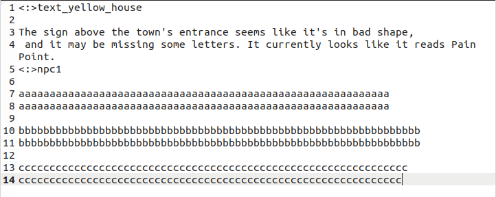

#### TXT file format

​	Each object will have a `std::vector<std::vector<std::string>>` data structure to store the text. 

> For NPC dialogue, each character will have a vector of dialogue options, and each dialogue option is a vector of strings, where each string is a line of text (in case there's too much text to put on the screen at one time)

​	 For example, `text_yellow_house`  has one option and two lines in this option. `npc1` has three options 	and two lines in each option.

Some rules:

1. starts with object name
   `<:>object_name`

2. Each **option** should start with a line containing **only** `\n` , like line 2 in the picture. Do check if there is invisible space in those lines, it will cause the parsing fail.

3. change the line if you want multiple line in one option, like line 3 and line 4

4. There shouldn't be extra `\n` when there is no more text for an object. Like there is no extra line between line 4 and line 5

​	**Note: Do not include extra space/extra `\n`!**

Python script usage:

call `python3 export_text.py [text_file_name] [binary_file_name]`
